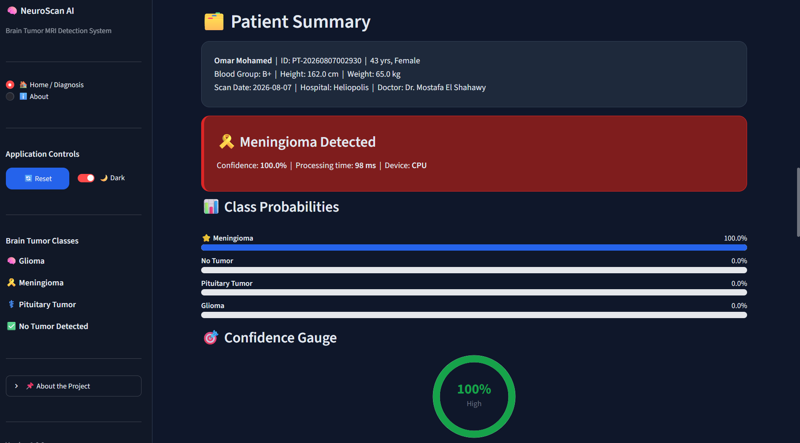
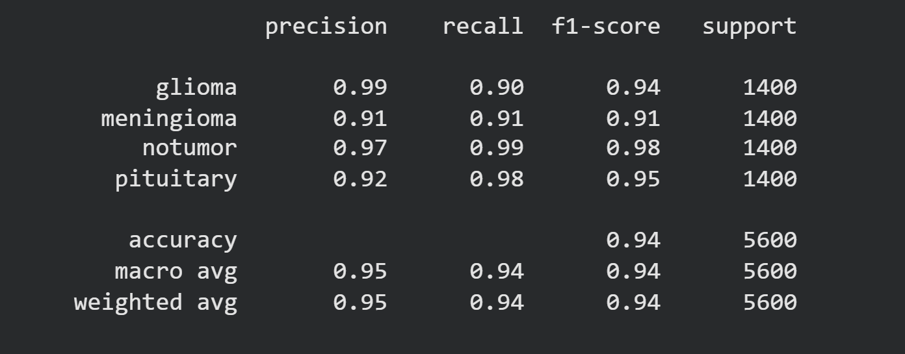
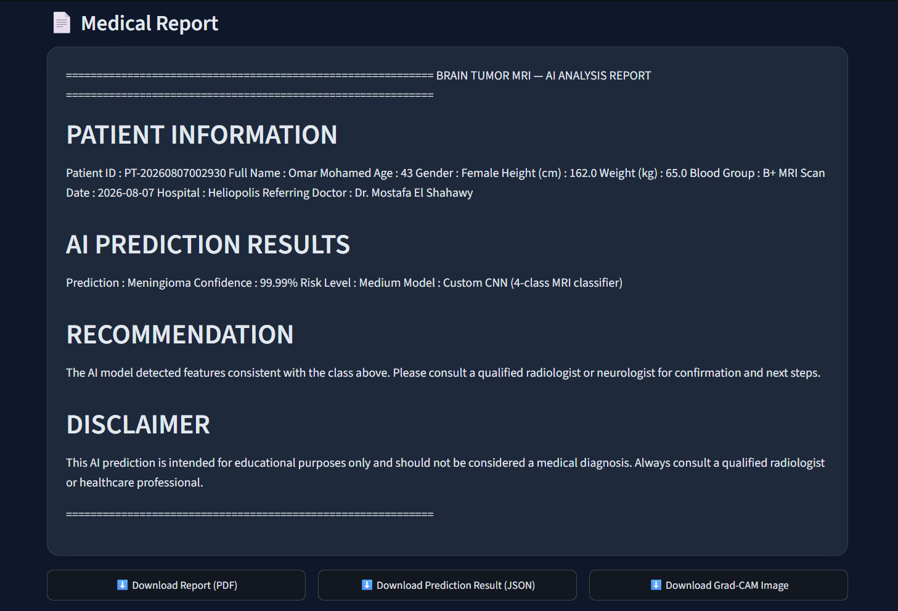
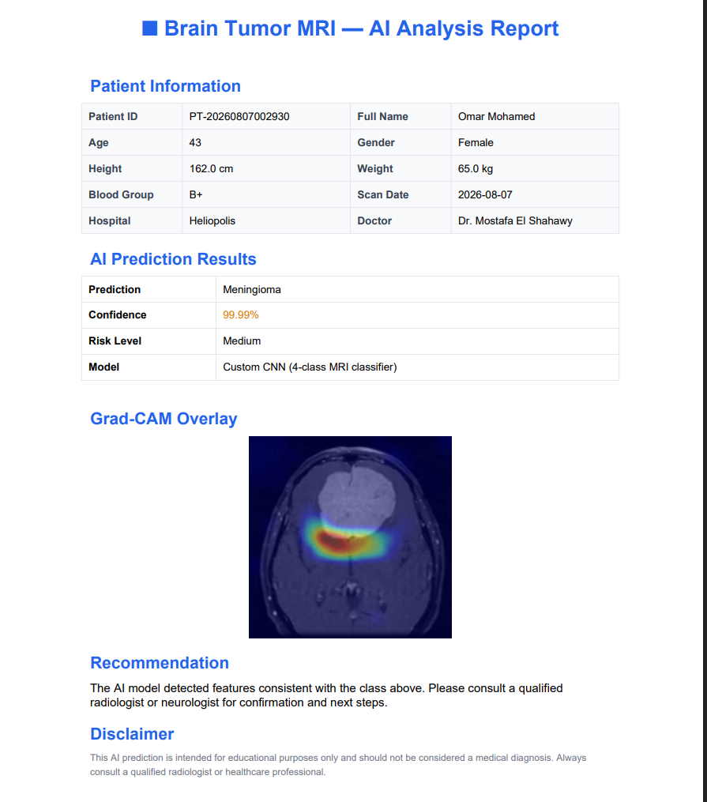
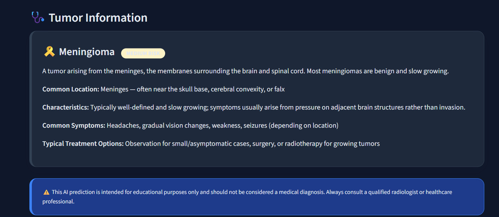

# 🧠 Brain Tumor MRI Classification Using CNN


### AI-Powered Medical Decision Support System

This project presents a deep learning-based system for automatic brain tumor classification from MRI images using a Convolutional Neural Network (CNN). The system also integrates Explainable AI (Grad-CAM) and an interactive Streamlit web application to assist healthcare professionals.

---

## 📌 Features

* Brain MRI Classification
* Four Classes:

  * Glioma
  * Meningioma
  * Pituitary Tumor
  * No Tumor
* CNN-based Classification Model
* Grad-CAM Heatmap Visualization
* Confidence Score
* Class Probability Distribution
* Patient Summary
* PDF Report Generation
* JSON Report Export
* Downloadable Heatmap Image
* Streamlit GUI

---

## 🗂 Dataset

* Total Images: **7200**
* Training Images: **5600**
* Testing Images: **1600**

Classes:

* Glioma
* Meningioma
* Pituitary
* No Tumor

---

## 🏗 Model Architecture

Our CNN architecture consists of:

* Conv2D (32)
* MaxPooling
* Conv2D (64)
* MaxPooling
* Conv2D (128)
* MaxPooling
* Flatten
* Dense (128)
* Dropout (0.3)
* Softmax Output Layer

Optimizer:
Adam

Loss Function:
Categorical Crossentropy

---

## 📈 Results

* Test Accuracy: **94%**
* Multi-class Classification
* Confusion Matrix
* Classification Report
* Precision
* Recall
* F1 Score

---

## 🔥 Explainable AI

Grad-CAM was integrated to visualize the regions of the MRI scan that influenced the CNN prediction, improving model interpretability and transparency.

---

## 💻 Streamlit Application

The application provides:

* MRI Upload
* Patient Information
* Prediction Result
* Confidence Gauge
* Class Probabilities
* Grad-CAM Heatmap
* Downloadable PDF Report
* Downloadable JSON Report
* Downloadable Heatmap Image

---

## 🚀 Installation (you can try it on your own just write the following in your terminal with the project data)

```bash
pip install -r requirements.txt
```

Run the application:

```bash
streamlit run app.py
```

---

## 🛠 Technologies Used

* Python
* TensorFlow / Keras
* OpenCV
* NumPy
* Streamlit
* Grad-CAM
* Matplotlib

---

## 📸 Project Screenshots

### 🖥️ Streamlit GUI



---

### 📊 Model Evaluation



---

### 📄 Medical Report



---

### 📑 PDF Report



---

### 🧠 Tumor Information



---

## 👥 Team
* Eman Rashad
* John Fawzy
* Sara Adel
* Seif Nour
